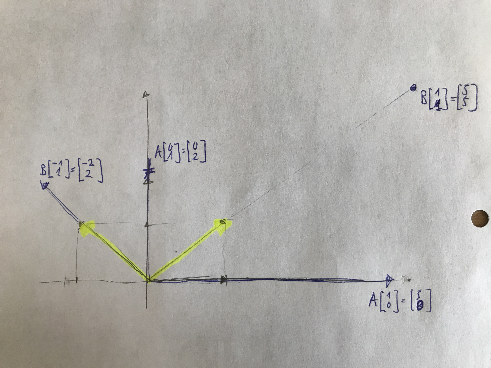
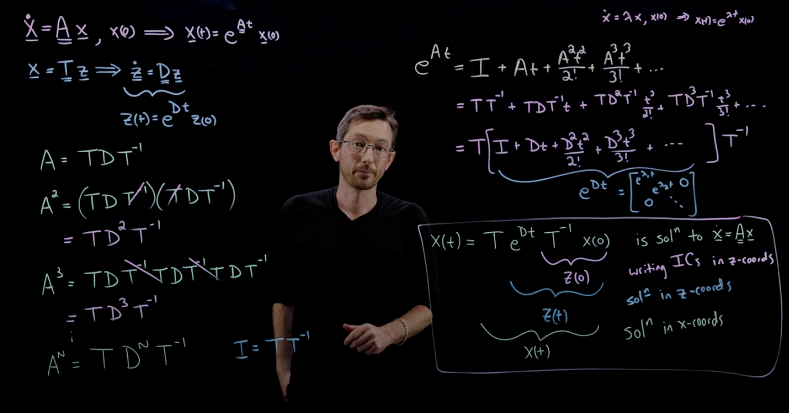

# Diagonalization

- __diagonal__ matrix: only non-zero entries are on diagonal
  - transformation: __scales__ along the __basis__ coordinate vectors

```
5 0 0 
0 1 0 
0 0 2
```

- __diagonalization__: performing a similarity transformation to express a matrix $A$ as $S \Lambda S^{-1}$, where $\Lambda$ is the diagonal matix of eigenvalues and $S$ the eigenvector matrix.

## Which matrices are diagonalizable?

- Any matrix represents a __transformation__. Any transformation is a combination of a __rotation__ and a __scaling__.
- Matrices which __only scale__ (don't have a rotation component) are __diagonalizable__

## Benefits of diagonal matrices

- A __diagonal__ matrix represents a __decoupled__ system (each equation is independent of the others). 
  - It's easy to solve
  - We can easily compute __powers__ of a diagonal matrix. i.e. applying $A$ many times over is easy.
    - This is useful for differential equations (which evolve over time)

### Examples

- $A = \begin{bmatrix} 5 & 0 \\\ 0 & 2 \end{bmatrix}$ scales by 5 along the x-axis and by 2 along the y-axis

- --> the eigenvectors are $\begin{bmatrix} 1 \\\ 0 \end{bmatrix}$ and $\begin{bmatrix} 0 \\\ 1 \end{bmatrix}$. __The eigenvalues are 5 and 2.__

- $B = \begin{bmatrix} 7/2 & 3/2 \\\ 3/2 & 7/2 \end{bmatrix}$ scales by 5 along the (1,1)-axis and by 2 along the (-1, 1)-axis.

- --> the eigenvectors are along the $\begin{bmatrix} 1 \\\ 1 \end{bmatrix}$ and the $\begin{bmatrix} -1 \\\ 1 \end{bmatrix}$ axis. __The eigenvalues are 5 and 2.__

--> The matrices A and B are __similar__. They perform the same linear map under 2 (possibly) different bases.



## System of differential equations

- Find eigenvectors and eigenvalues
- Transform problem to new coordinate system (using $S^{-1}$)
- Solve problem in new coordinate system (__eigenbasis__)
- Transform problem back to original coordinate system (using $S$)

Credit to Steve Brunton

